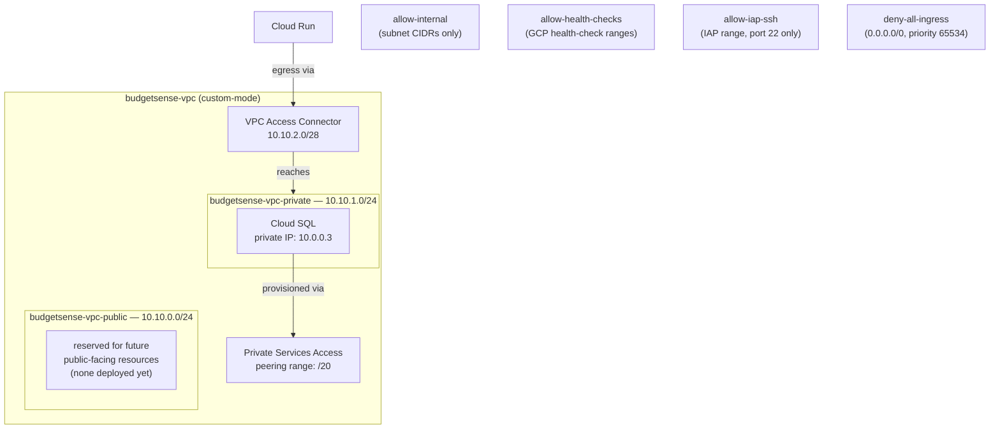
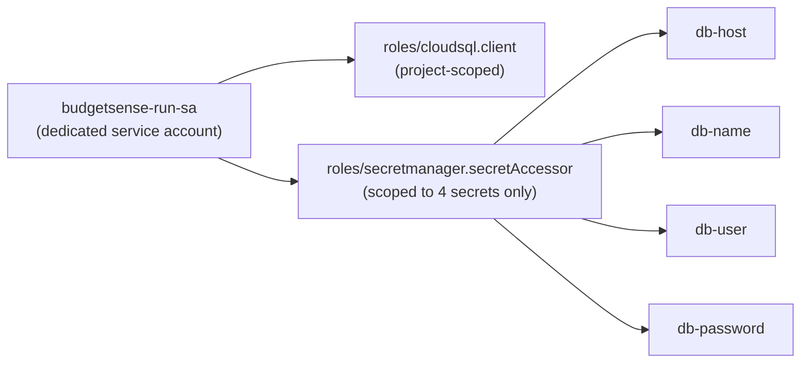
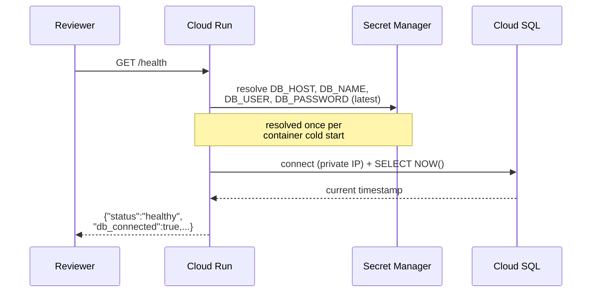
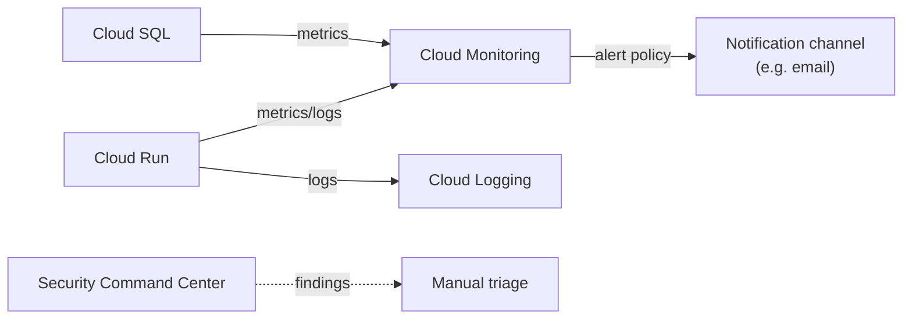
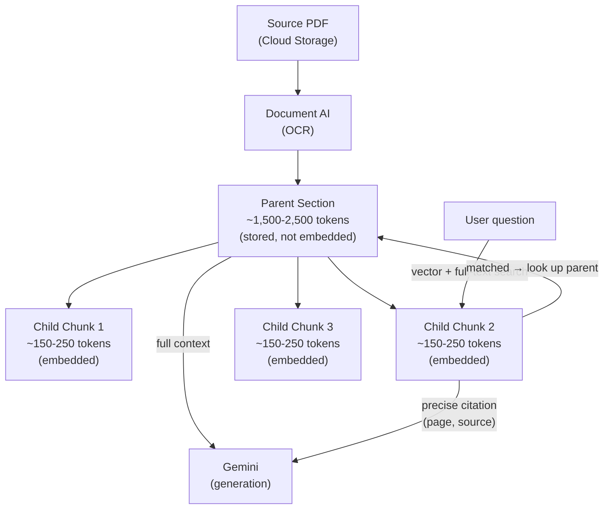
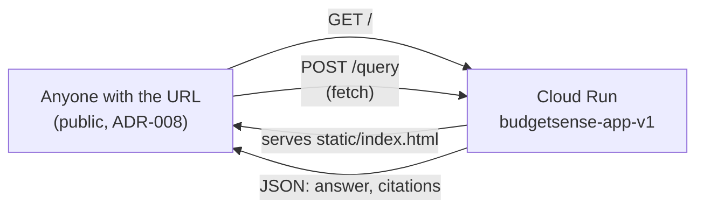

# Architecture Document: BudgetSense-GCP

## Document Control

| Field               | Value                                                                                             |
| ------------------- | ------------------------------------------------------------------------------------------------- |
| Status              | Living document — updated as Epics complete                                                       |
| Owner               | Claude, acting as Architect, on behalf of Nitish Bhushan                                          |
| Companion documents | `docs/PRD.md` (what/why), `docs/decisions.md` (individual ADRs), `specs/NNN-*/` (per-Epic detail) |

This document is the **consolidated "how"** — it doesn't replace individual specs or
ADRs, it ties them together into one coherent system view.

---

## 1. Architectural Goals

Ranked, since they occasionally trade off against each other:

1. **Explainability** — every component must be defensible under questioning, not
   just functional.
2. **Zero idle cost** — this is a demo project, not production; nothing should bill
   while not actively being used.
3. **Least privilege by default** — identity, network, and secrets access are all
   scoped as narrowly as the system allows.
4. **Data residency** — everything lives in Australian GCP regions.
5. **Reproducibility** — Terraform manages the foundation; manual-console-first is a
   _learning_ choice, not a permanent one (see ADR-001).

Where goals conflict (e.g. Epic 1's untagged firewall rules trade some blast-radius
control for operational simplicity — ADR-003, or Epic 7's public Cloud Run access
trades goal #3 for reviewer reachability — ADR-008), the tradeoff is documented, not
hidden.

---

## 2. System Context

```mermaid
graph TB
    Reviewer["Technical Reviewer<br/>(public web UI, any time)"]
    Internet["Public Internet"]
    CloudRun["Cloud Run<br/>budgetsense-app-v1<br/>(Python/FastAPI + static UI)"]
    CloudSQL["Cloud SQL<br/>PostgreSQL<br/>(private IP only)"]
    SecretMgr["Secret Manager<br/>(4 scoped secrets)"]
    ArtifactReg["Artifact Registry<br/>(Docker images)"]
    VPC["VPC: budgetsense-vpc<br/>public + private subnets"]
    GitHub["GitHub Repo<br/>(audit trail: specs, ADRs, runbooks)"]

    Reviewer -->|"HTTPS, unauthenticated<br/>(ADR-008)"| Internet
    Internet -->|"/, /health, /query"| CloudRun
    CloudRun -->|"private IP,<br/>via VPC connector"| CloudSQL
    CloudRun -->|"secretAccessor<br/>(scoped)"| SecretMgr
    CloudRun -.->|"pulls image at deploy"| ArtifactReg
    CloudRun -.->|"lives inside"| VPC
    CloudSQL -.->|"lives inside"| VPC
    Reviewer -->|"inspects build history"| GitHub

    style CloudSQL fill:#2d3748,stroke:#e53e3e
    style SecretMgr fill:#2d3748,stroke:#ecc94b
```

**Key property visible in this diagram:** Cloud SQL has no path to/from the public
internet at all. The _only_ way to reach it is through Cloud Run, through the VPC
connector, over a private IP. The Cloud Run service itself, by contrast, is
deliberately public (ADR-008) — the security boundary in this system sits at the
database and network layer, not at the application's front door.

---

## 3. Network Architecture (Epic 1)

**Firewall posture:** default-deny, explicit-allow. As of ADR-003, all four rules
apply broadly (no target-tag requirement) — a deliberate simplicity-over-scoping
tradeoff for a solo-maintained project (documented tradeoff: `allow-iap-ssh` now
applies VPC-wide, mitigated by IAP still requiring an explicit IAM grant to connect).

**IaC status:** 100% of this layer is Terraform-managed (imported post-hoc from the
manual build — see ADR-001, ADR-002 in `docs/decisions.md`). `terraform plan` shows
zero drift.

---

## 4. Identity & Secrets Architecture (Epic 2 — partial)

**Deliberate exclusions:** `budgetsense-run-sa` does NOT have:

- Project Editor/Owner
- Broad Secret Manager access (project-wide `secretAccessor`)
- Any Compute Engine or GKE-related roles (not needed, nothing runs there)

**Known gap (PRD Epic 2, Stories 2.4–2.5):** Cloud Audit Logs review and a full
project-wide IAM binding review have not yet been performed. This is the weakest
part of the current build and the next priority before claiming Epic 2 "Done."

**Note (Epic 7):** the workload identity model above governs what the _service_
can do (DB access, secrets). It is unrelated to and unaffected by ADR-008, which
governs who can _invoke_ the service over HTTP. The service account's own
permissions remain unchanged and still least-privilege-scoped regardless of the
service being publicly invokable.

---

## 5. Application Workload Architecture (Epic 3)

**Container:** Python 3.12-slim, FastAPI + Uvicorn, `psycopg` v3 for a direct
private-IP Postgres connection (no Cloud SQL Auth Proxy needed, since private
networking is already established at the VPC layer). Originally built with
`psycopg2-binary`; migrated to `psycopg` v3 during Epic 6/7 to standardize on
one driver project-wide after `psycopg2-binary` failed to build a wheel on
Python 3.14 in local development.

**Scale-to-zero:** `min-instances=0`. No cost while idle — the defining cost
constraint for this whole project (ADR-002).

**Two real production-grade lessons surfaced during this Epic** (see
`specs/003-workload/runbook.md` for full detail):

1. Cloud Run's `latest` secret reference is resolved **once, at revision creation**
   — not dynamically. "Redeploy" on an existing revision does not re-resolve it; a
   genuinely new revision is required.
2. An invisible leading-space character in an environment variable name caused
   PostgreSQL to silently fall back to defaulting the database name to the
   connecting username — a subtle failure mode only diagnosable by comparing raw
   `gcloud describe --format=yaml` output against the Console UI.

---

## 6. Target Architecture — Remaining Epics

### 6.1 Observability (Epic 4, done)

### 6.2 Governance (Epic 5, backlog)

Organization Policies applied at the project (or folder, if one exists) level:

- `constraints/gcp.resourceLocations` restricted to `australia-southeast1` /
  `australia-southeast2`
- `constraints/compute.vmExternalIpAccess` / equivalent Cloud SQL public-IP
  restriction, enforced as policy rather than relying on per-resource convention

### 6.3 Applied AI — RAG Layer (Epic 6, Phases A–E complete, Phase F pending)

**Hierarchical (parent-child) chunking**, not flat chunking:

**Retrieval (Phase C, done):** hybrid search combines pgvector cosine-distance
search and Postgres full-text search via Reciprocal Rank Fusion (rank-position
based, not raw score — the two signals aren't on comparable scales), with an
authority-tier soft boost (primary vs. summary sources) applied after fusion,
not as a hard filter.

**Generation (Phase D, done):** Gemini answers only from retrieved parent
sections, with an explicit instruction to ignore outside/training knowledge and
a required exact refusal phrase for no-match cases. Citations are extracted via
regex against a prompt-enforced `[Source N, p.X]` format rather than requesting
JSON output directly from the model.

**Endpoint (Phase E, done):** `POST /query` on the existing `budgetsense-app-v1`
Cloud Run service, reusing the same DB connection and secret-resolution pattern
as `/health` — no new identity or networking surface.

**Known limitations, found during testing and deliberately scoped out rather
than fixed in this Epic:**

- Table-heavy source pages (e.g. a Defence payment-measures table) can produce
  chunks containing a relevant keyword without the associated figure —
  fragmented tabular content is a known weak point of the current chunking
  approach on narrative-oriented parsing.
- Vector-distance alone is not a clean "not found" signal — a real question's
  distance (~0.37) was observed close to a negative-control question's distance
  (~0.41). Gemini's own groundedness judgment on retrieved text is the primary
  "not found" mechanism; distance is a soft supporting signal only.
- A single confirmed instance of a page-number metadata mismatch (stored value
  vs. the PDF's own printed page label) was found during manual citation
  checking; cause unconfirmed (possibly a front-matter offset in Document AI's
  page indexing), deferred to Phase F for proper investigation with more
  samples.

Embedding model: Vertex AI `text-embedding-005`, 768 dimensions, `RETRIEVAL_DOCUMENT`
task type at ingestion, `RETRIEVAL_QUERY` at query time.

### 6.4 Frontend (Epic 7, in progress)

No new GCP resources (ADR-007). The existing FastAPI app gains a `StaticFiles`
mount serving one self-contained HTML/CSS/JS file, which calls the
already-existing `/query` endpoint client-side via `fetch()`. Same-origin
requests (UI and API on the same Cloud Run domain) avoid any CORS
configuration entirely.

The service is deliberately public and unauthenticated (ADR-008) — a
reviewer can open the URL at any time without a live session or credential
exchange with the project owner, which is the whole point of building a UI
in the first place (see `docs/project-brief.md` §2, "independently
accessible").

---

## 7. Cross-Cutting Decisions (index into `docs/decisions.md`)

| ADR     | Decision                                              | Epic |
| ------- | ----------------------------------------------------- | ---- |
| ADR-001 | Manual Console build before Terraform                 | 1    |
| ADR-002 | Cloud Run over GKE (cost-driven)                      | 3    |
| ADR-003 | Untagged (broadly-applied) firewall rules             | 1    |
| ADR-004 | Cloud SQL + pgvector over Vertex AI Vector Search     | 6    |
| ADR-005 | Hierarchical (parent-child) chunking                  | 6    |
| ADR-006 | Document AI processor region exception (`us`)         | 6    |
| ADR-007 | Serve demo UI from Cloud Run, not a separate GCS site | 7    |
| ADR-008 | Public unauthenticated access to Cloud Run            | 7    |

---

## 8. Non-Functional Requirements Summary

| Requirement                      | Current Status                                                                                                                                             |
| -------------------------------- | ---------------------------------------------------------------------------------------------------------------------------------------------------------- |
| $0 idle cost                     | ✅ Cloud Run min-instances=0; no GKE cluster fee; no new resources for Epic 7 (ADR-007)                                                                    |
| Data residency (AU regions only) | 🟡 Convention-enforced (all resources manually placed in `australia-southeast1`, except ADR-006's Document AI exception); NOT yet policy-enforced (Epic 5) |
| No public database access        | ✅ Cloud SQL private-IP only                                                                                                                               |
| No secrets in code/images        | ✅ All 4 DB credentials via Secret Manager                                                                                                                 |
| Least-privilege identity         | 🟡 Workload SA is scoped correctly; full IAM audit not yet performed (Epic 2)                                                                              |
| IaC-managed foundation           | ✅ Epic 1 fully Terraform-imported and drift-free                                                                                                          |
| Public UI reachability           | 🟡 Deliberately public (ADR-008) — trades the least-privilege goal for demo reachability, not accidental exposure                                          |

## 9. Target End-State Architecture (Reference)

The diagrams in §6.3 (Applied AI — RAG Layer) reflect Epic 6's current committed
scope. The full product vision (see `docs/PRD.md` §7) implies a richer version of
that layer:

**Additional components beyond Epic 6's current diagram:**

| Component              | GCP Service                                         | Role                                                                                                                                                                                                                                    |
| ---------------------- | --------------------------------------------------- | --------------------------------------------------------------------------------------------------------------------------------------------------------------------------------------------------------------------------------------- |
| Agent orchestrator     | Cloud Run (extends the existing API service)        | Runs the ReAct control loop in application code — not a separate managed agent product, so the reasoning stays auditable in-repo                                                                                                        |
| Hybrid retrieval store | Cloud SQL + `pgvector` (reuses the Epic 3 instance) | Dense vector + native full-text (BM25-style) search combined via Reciprocal Rank Fusion, plus an authority-tier weighting column — mirrors [[budgetsense-ai]]'s AWS design more closely than a pure Vertex AI Vector Search index would |
| Semantic cache         | Memorystore for Redis                               | GCP equivalent of BudgetSense's ElastiCache Redis; cuts latency and Gemini token cost on repeated/similar questions                                                                                                                     |
| Agent actions          | Cloud Tasks + Cloud Functions                       | Decoupled from the request/response cycle — the agent queues a task rather than executing an action synchronously and unpredictably inline                                                                                              |
| Trust badge            | Computed in the API layer (no new service)          | Derived from source authority tier + retrieval confidence + citation coverage                                                                                                                                                           |

**Why this isn't in §6.3 as committed architecture yet:** these components
represent a larger scope than Epic 6's current Stories commit to (see PRD §7 for
the scope boundary). This section exists so the target shape is documented before
it's built, consistent with this project's spec-before-code discipline — but it is
explicitly a reference, not yet a spec.
