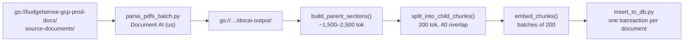
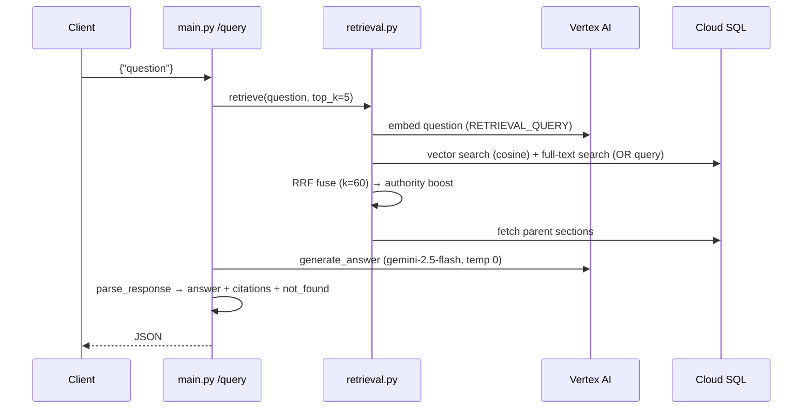

# Development Guide: BudgetSense-GCP

## Document Control

| Field               | Value                                                                                                                  |
| ------------------- | ---------------------------------------------------------------------------------------------------------------------- |
| Status              | Living document — update when setup, commands, or pipeline behaviour change                                            |
| Audience            | Anyone running, changing, or deploying the code (including future-me)                                                  |
| Companion documents | `docs/architecture.md` (system "how"), `docs/decisions.md` (ADRs), `docs/PRD.md` (what/why), `specs/NNN-*/` (per-Epic) |

This is the **project-wide developer guide**: how to set up a machine, run the
code locally, re-ingest documents, test the RAG pipeline, deploy, and reason
about Gemini token cost. It is different from the per-Epic
`specs/NNN-*/development.md` files, which are step-by-step build checklists for
a single Epic.

---

## 1. Tech Stack at a Glance

| Layer          | Technology                                                                    |
| -------------- | ----------------------------------------------------------------------------- |
| Language       | Python 3.12 (container); local dev also works on newer Python (3.14 tested)   |
| API            | FastAPI + Uvicorn (`src/main.py`)                                             |
| UI             | Single static HTML/CSS/JS page (`src/static/index.html`, ADR-007)             |
| Database       | Cloud SQL for PostgreSQL + `pgvector`, private IP only                        |
| DB driver      | `psycopg` v3 (not `psycopg2` — see architecture.md §5)                        |
| PDF parsing    | Document AI OCR processor, region `us` (ADR-006)                              |
| Embeddings     | Vertex AI `text-embedding-005`, 768 dimensions                                |
| Generation     | Vertex AI `gemini-2.5-flash`, via the `google-genai` SDK                      |
| Hosting        | Cloud Run `budgetsense-app-v1`, `australia-southeast1`, min-instances=0       |
| Infrastructure | Terraform for the network foundation (`infra/terraform`); rest built manually |

---

## 2. Repository Layout

```
docs/                      Project-wide docs (this file, architecture, ADRs, PRD, brief)
docs-corpus/               Local copies of the 11 source Budget PDFs
specs/NNN-name/            spec.md (before code), development.md (build checklist),
                           runbook.md (as-built record)
infra/terraform/           VPC, subnets, firewall rules (Epic 1, imported, drift-free)
cloud-sql-proxy.exe        Cloud SQL Auth Proxy binary for local DB access (Windows)
src/
  main.py                  FastAPI app: GET / (UI), GET /health, POST /query
  Dockerfile               Cloud Run container image
  requirements.txt         Runtime dependencies (API only — see §3.2)
  static/index.html        Public demo UI
  rag/
    retrieval.py           Hybrid search: vector + full-text → RRF → authority boost → parent lookup
    generation.py          Grounded Gemini prompt + citation parsing
    agent.py               Epic 8: decompose → multi-hop retrieve → sufficiency check
    run_test_questions.py  Retrieval harness over the 5 Epic 6 test questions + negative control
    test_*.py              Manual harnesses for each RAG stage (see §7)
  read_pdfs.py             Ingestion B1: read PDFs from Cloud Storage
  parse_pdfs_batch.py      Ingestion B2: Document AI batch OCR
  test_parent_sections.py  Ingestion B3: page-aware parent sections (~1,500–2,500 tokens)
  split_child_chunks.py    Ingestion B4: child chunks (~200 tokens, 40 overlap)
  authority_tiers.py       Ingestion B5: primary vs summary tier per document
  embed_chunks.py          Ingestion B6: document embeddings
  insert_to_db.py          Ingestion B7: write sections + chunks to Cloud SQL
  clear_test_data.py       Deletes all sections and chunks (destructive — see §6)
  inspect_schema.py        Prints table schema and sample rows
  test_db_connection.py    Confirms the proxy tunnel works; prints row counts
```

---

## 3. Local Setup

### 3.1 Prerequisites

- Python 3.12+ and `git`
- Google Cloud SDK (`gcloud`), signed in to an account with access to
  project `budgetsense-gcp-prod`
- Terraform ≥ 1.5 (only if touching `infra/terraform`)
- Docker (only if building the image locally rather than with Cloud Build)

### 3.2 Python environment

```bash
cd src
python -m venv .venv
source .venv/Scripts/activate      # Git Bash on Windows; use .venv/bin/activate on macOS/Linux
pip install -r requirements.txt
```

`requirements.txt` holds **API runtime dependencies only**. The ingestion scripts
also need the Cloud Storage and Document AI clients, which are intentionally
kept out of the container image:

```bash
pip install google-cloud-storage google-cloud-documentai
```

### 3.3 Google Cloud credentials

All Vertex AI, Document AI, and Cloud Storage calls use Application Default
Credentials — there are no API keys in this project.

```bash
gcloud auth login
gcloud config set project budgetsense-gcp-prod
gcloud auth application-default login
```

Your user account needs the same capabilities `budgetsense-run-sa` has for
whatever you run locally: Vertex AI User (`roles/aiplatform.user`) for
embeddings/Gemini, Document AI API User for parsing, and Storage Object
Viewer/Admin on `budgetsense-gcp-prod-docs` for ingestion.

### 3.4 Environment variables (`src/.env`)

`src/.env` is git-ignored and loaded with `python-dotenv`. Never commit it.

| Variable      | Local value                        | Cloud Run source             |
| ------------- | ---------------------------------- | ---------------------------- |
| `DB_HOST`     | `127.0.0.1` (Cloud SQL Auth Proxy) | Secret Manager `db-host`     |
| `DB_PORT`     | `5433`                             | Defaults to `5432` in code   |
| `DB_NAME`     | `budgetsense`                      | Secret Manager `db-name`     |
| `DB_USER`     | `budgetsense_app`                  | Secret Manager `db-user`     |
| `DB_PASSWORD` | the app user's password            | Secret Manager `db-password` |

> Watch for invisible whitespace in variable **names** — a leading space in
> `DB_NAME` once caused a misleading `database "budgetsense_app" does not exist`
> error (specs/003-workload/runbook.md, issue 3).

### 3.5 Reaching Cloud SQL from your machine

Cloud SQL has no public IP, so local scripts reach it through the Cloud SQL
Auth Proxy on port **5433** (5433 avoids clashing with any local Postgres on 5432):

```bash
./cloud-sql-proxy.exe --port 5433 --private-ip budgetsense-gcp-prod:australia-southeast1:budgetsense-db
```

The proxy must be able to reach the private IP. If your machine isn't on a
network peered with `budgetsense-vpc`, drop `--private-ip` only if a public IP
is temporarily enabled — which contradicts the "no public DB access" requirement,
so prefer connecting from inside the VPC (e.g. an IAP-tunnelled VM) instead.

Verify the tunnel:

```bash
cd src
python test_db_connection.py
```

---

## 4. Running the API Locally

With the proxy running and `.env` filled in:

```bash
cd src
uvicorn main:app --reload --port 8080
```

| Endpoint      | Purpose                                                           |
| ------------- | ----------------------------------------------------------------- |
| `GET /`       | Serves the demo UI (`static/index.html`)                          |
| `GET /health` | Live DB round-trip (`SELECT NOW()`); 503 if the DB is unreachable |
| `POST /query` | Grounded Q&A. Body: `{"question": "..."}`                         |
| `GET /docs`   | FastAPI's auto-generated Swagger UI                               |

Example:

```bash
curl -X POST http://localhost:8080/query -H "Content-Type: application/json" -d '{"question": "What is the WATO tax offset amount?"}'
```

Response shape (unchanged by Epic 8 — Story 8.6):

```json
{
  "answer": "…",
  "citations": [
    {
      "source_document": "Budget Measures_2026-27",
      "page_number": 36,
      "authority_tier": "primary",
      "url": "https://storage.googleapis.com/budgetsense-gcp-prod-docs-public/Budget Measures_2026-27.pdf#page=36"
    }
  ],
  "not_found": false
}
```

---

## 5. Data Model

Two tables in the `budgetsense` database (hierarchical chunking, ADR-005):

| Table               | Key columns                                                                                                                               | Notes                                                                                         |
| ------------------- | ----------------------------------------------------------------------------------------------------------------------------------------- | --------------------------------------------------------------------------------------------- |
| `document_sections` | `id`, `source_document`, `page_number` (start page), `authority_tier`, `section_text`                                                     | Parent sections, ~1,500–2,500 tokens. Stored, **not** embedded.                               |
| `document_chunks`   | `id`, `section_id` → sections, `source_document`, `page_number`, `authority_tier`, `chunk_text`, `embedding vector(768)`, `search_vector` | Child chunks, ~200 tokens. Searched. `search_vector` is `GENERATED ALWAYS` — never insert it. |

Indexes: `ivfflat` on `embedding` (cosine), GIN on `search_vector`.
Run `python inspect_schema.py` to print the live schema.

---

## 6. Ingestion Pipeline (re-indexing documents)

Ingestion runs **locally**, not on Cloud Run. The scripts run from `src/`.



### Adding or replacing a source document

1. Upload the PDF to `gs://budgetsense-gcp-prod-docs/source-documents/`.
2. Add its filename (without `.pdf`) to `AUTHORITY_TIERS` in
   `src/authority_tiers.py` as `primary` or `summary`. Ingestion **fails on
   purpose** for an untiered document.
3. Copy it to the public bucket too, or its citation links will 404 (ADR-009):
   ```bash
   gcloud storage cp "docs-corpus/<file>.pdf" gs://budgetsense-gcp-prod-docs-public/
   ```

### Running a full re-ingestion

```bash
cd src
python test_db_connection.py      # proxy up? current row counts?
python parse_pdfs_batch.py        # Document AI batch job; clears docai-output/ first
python clear_test_data.py         # DELETES every section and chunk
python insert_to_db.py            # reads existing docai-output/, embeds, inserts
python test_db_connection.py      # confirm new row counts per document
```

- `insert_to_db.py` calls `load_existing_batch_output()`, so it **reuses** the
  last Document AI run rather than paying for a new one. Only rerun
  `parse_pdfs_batch.py` when the PDFs themselves changed.
- `clear_test_data.py` wipes both tables with no confirmation prompt. Run it
  only immediately before `insert_to_db.py`.
- Embeddings are requested in batches of 200 to stay under Vertex's
  250-inputs-per-request limit.

---

## 7. The RAG Pipeline

### 7.1 Single-pass flow (current `/query`, Epic 6)



### 7.2 Multi-hop flow (Epic 8, `rag/agent.py`)

`gather_context()` = decompose (1–4 sub-questions) → `retrieve()` per
sub-question → dedupe by `section_id` → sufficiency check → **at most one**
gap-fill retrieval → hand to `generate_answer`. It is built and tested but
**not yet wired into `/query`** (Spec 008, Phase E1).

### 7.3 Tunable parameters

| Parameter                  | Value                                         | Where                           |
| -------------------------- | --------------------------------------------- | ------------------------------- |
| Parent section size        | 1,500–2,500 tokens (≈ chars/4)                | `test_parent_sections.py`       |
| Child chunk size / overlap | 200 / 40 tokens                               | `split_child_chunks.py`         |
| `top_k` per retrieval      | 5                                             | `main.py`, `agent.py`           |
| RRF constant `k`           | 60                                            | `retrieval.py` `rrf_fuse`       |
| Authority weights          | primary 1.0, summary 0.85                     | `retrieval.py` `TIER_WEIGHTS`   |
| Sub-questions              | 1–4                                           | `agent.py` `decompose_question` |
| Sufficiency excerpt length | first 200 chars per section                   | `agent.py` `check_sufficiency`  |
| Gap-fill retries           | exactly 1 (hard cap)                          | `agent.py` `gather_context`     |
| Generation temperature     | 0.0 for every Gemini call                     | `generation.py`, `agent.py`     |
| Exact refusal phrase       | "Not found in the provided budget documents." | `generation.py`                 |

Changing chunk sizes requires a full re-ingestion (§6). Changing retrieval or
prompt parameters does not.

---

## 8. Testing

There is no automated test suite yet. Testing is done with **manual harness
scripts** that print intermediate results, and their outputs are pasted into
the script's trailing docstring and the Epic's runbook as the record.

The `rag/` scripts import siblings as top-level modules (`from retrieval import …`),
so run them **from inside `src/rag/`**, with the proxy running.

| Script                       | Run from   | What it checks                                                  |
| ---------------------------- | ---------- | --------------------------------------------------------------- |
| `test_db_connection.py`      | `src/`     | Proxy tunnel, row counts per document                           |
| `inspect_schema.py`          | `src/`     | Table columns, generated column, embedding dimensions           |
| `test_embeddings.py`         | `src/`     | Embedding call returns 768-dim vectors (runs a Document AI job) |
| `rag/test_retrieval.py`      | `src/rag/` | Each retrieval stage separately: vector, full-text, RRF, boost  |
| `rag/run_test_questions.py`  | `src/rag/` | 5 Epic 6 regression questions + Mars negative control           |
| `rag/test_decompose.py`      | `src/rag/` | Question decomposition only — no DB needed                      |
| `rag/test_multi_hop.py`      | `src/rag/` | Decompose + multi-hop retrieval                                 |
| `rag/test_gather_context.py` | `src/rag/` | Full Epic 8 Phases A–C, including the sufficiency retry         |

### Standing test questions

| Question                                                          | Expected                                          |
| ----------------------------------------------------------------- | ------------------------------------------------- |
| What is the WATO tax offset amount?                               | Single hop; cited figure                          |
| What is the instant tax deduction amount for working Australians? | Single hop; cited figure                          |
| What is the fuel excise reduction?                                | Single hop; cited figure                          |
| What is the underlying cash balance forecast?                     | Single hop; cited figure                          |
| What is the gas reservation percentage?                           | Single hop; cited figure                          |
| What is the Budget's plan for Mars colonization?                  | `not_found: true` — **never** a fabricated answer |
| Discretionary trust (20 years) — what changes and when?           | 2 sub-questions; trust explainer cited            |
| Best way to reduce my tax as a working couple with kids?          | Advice reworded into factual sub-questions        |

Any change to retrieval, prompts, or models must re-run all of these, and
every citation should be spot-checked against the source PDF page.

---

## 9. Build and Deploy

Deployment is manual (no CI/CD — Spec 003). Images live in Artifact Registry
repo `budgetsense-images` (`australia-southeast1`). Bump the tag on every
deploy (`v4`, `v5`, …) rather than overwriting. Run every command from `src/`,
where the `Dockerfile` and `.env` live.

**1. Sanity-check the import** — catches startup errors in one second, before Docker:

```bash
python -c "import main"
```

### 2. Local dev server (fastest way to test UI/frontend changes)

From `src/`, with the Cloud SQL Auth Proxy running on port 5433:

```bash
python -m uvicorn main:app --host 0.0.0.0 --port 8080 --reload
```

Open http://localhost:8080/ in a browser. --reload picks up changes to
main.py, rag/, and static/ automatically - just refresh the browser after
editing static/index.html, no restart needed. Use this whenever changing
the UI, not the full Docker build - much faster iteration loop.

Note: --reload is for local development only, never used in the Dockerfile's
CMD (adds file-watching overhead production doesn't need).

**2. Build the image locally:**

```bash
docker build -t budgetsense-app:test .
```

**3. Run it and confirm it starts** — expect `Application startup complete` with no traceback:

```bash
docker run -p 8080:8080 --env-file .env budgetsense-app:test
```

Locally the container has no route to Cloud SQL's private IP, so `/health`
failing here is expected. This step checks only that the app starts.

**4. Confirm it is serving** (second terminal) — expect the UI's HTML, not a
connection refused. Stop the container afterwards (`Ctrl+C`).

```bash
curl http://localhost:8080/
```

**5. Authenticate Docker to Artifact Registry** (once per machine):

```bash
gcloud auth configure-docker australia-southeast1-docker.pkg.dev
```

**6. Tag and push:**

```bash
docker tag budgetsense-app:test australia-southeast1-docker.pkg.dev/budgetsense-gcp-prod/budgetsense-images/budgetsense-app:v6
```

**1. Rebuild the image** (from inside `src/`):

```bash
docker build -t australia-southeast1-docker.pkg.dev/budgetsense-gcp-prod/budgetsense-images/budgetsense-app:v6 .
```

**2. Push it:**

```bash
docker push australia-southeast1-docker.pkg.dev/budgetsense-gcp-prod/budgetsense-images/budgetsense-app:v6
```

**3. Deploy the new revision:**

```bash
gcloud run deploy budgetsense-app-v1 --image australia-southeast1-docker.pkg.dev/budgetsense-gcp-prod/budgetsense-images/budgetsense-app:v6 --region=australia-southeast1
```

**4. Verify it's actually live and correct** — open the real Cloud Run URL in a browser (not curl this time, since we want to see the UI itself):

```
https://budgetsense-app-v1-401917747007.australia-southeast1.run.app/
```

Then run the standing test questions (§8) against the live `/query`.

**Deploy gotchas (from runbooks):**

- `latest` secret references resolve **once per revision**. After rotating a
  secret, create a new revision (`gcloud run services update …`); "Redeploy"
  in the Console does not re-read it.
- Verify env/secret config with
  `gcloud run services describe budgetsense-app-v1 --region australia-southeast1 --format=yaml`,
  not Console screenshots.
- The Dockerfile copies files explicitly. Any new top-level file or folder the
  app needs at runtime (e.g. `static/`) must be added to it.

### Infrastructure (Terraform)

Only the network foundation is Terraform-managed. State is local (ADR-001).

```bash
cd infra/terraform
terraform init
terraform plan      # must show zero drift before any change
```

---

## 10. Token Cost and Optimization

Every question costs money only at the Vertex AI calls; Cloud Run and Cloud SQL
costs are covered by §8 of architecture.md.

### 10.1 Prices (Gemini 2.5 Flash, per 1M tokens, as of Sept 2026)

| Item                                   | Standard                        | Batch |
| -------------------------------------- | ------------------------------- | ----- |
| Input                                  | $0.30                           | $0.15 |
| Output (**thinking tokens included**)  | $2.50                           | $1.25 |
| Cached input                           | $0.03                           | $0.03 |
| Gemini 2.5 Flash-Lite (for comparison) | $0.10 in / $0.40 out            |       |
| `text-embedding-005`                   | ~$0.000025 per 1,000 characters |       |

Re-check the [Vertex AI pricing page](https://cloud.google.com/vertex-ai/generative-ai/pricing)
before relying on these.

### 10.2 Formula

```
cost per call = input_tokens × $0.30/1M + (output_tokens + thinking_tokens) × $2.50/1M
```

Gemini 2.5 Flash **thinks by default**, and those hidden tokens are billed at
the output price. None of the current calls disable it.

### 10.3 Estimated cost per question

| Flow                           | Gemini calls | Approx. input tokens      | Approx. cost / question | Per 1,000 questions |
| ------------------------------ | ------------ | ------------------------- | ----------------------- | ------------------- |
| Single-pass (current `/query`) | 1            | ~10.5K (5 sections)       | $0.005–$0.007           | ~$6                 |
| Multi-hop (Epic 8)             | 3            | ~20K–50K (10–25 sections) | $0.015–$0.025           | ~$15–$25            |

The answer-generation call dominates: each parent section is ~2K tokens, and
multi-hop can collect many more sections than single-pass. Embedding cost is
negligible.

### 10.4 Measuring real usage

Every `generate_content` response carries `usage_metadata`. Log it per call:

```python
u = response.usage_metadata
logger.info("llm_usage step=%s in=%s out=%s think=%s cached=%s",
            step, u.prompt_token_count, u.candidates_token_count,
            u.thoughts_token_count, u.cached_content_token_count)
```

`client.models.count_tokens(model=..., contents=prompt)` counts a prompt
without generating anything.

### 10.5 Optimization backlog (highest payoff first)

1. **Disable thinking on decompose and sufficiency calls** —
   `thinking_config=ThinkingConfig(thinking_budget=0)`. Both return small
   JSON. Evaluate a zero or small budget on generation against §8's questions.
2. **Cap context sent to generation** — limit `multi_hop_retrieve` output to
   a token budget (e.g. ~15K tokens or top 8 sections).
3. **Use Flash-Lite for decompose and sufficiency** — ~3× cheaper input,
   ~6× cheaper output.
4. **Skip decomposition for simple questions** (Story 8.5 routing).
5. **Answer cache in Cloud SQL** — table keyed on a normalized-question hash;
   zero idle cost, unlike Memorystore.
6. **Set `max_output_tokens`** on every call.
7. **Billing budget alert + Vertex AI quota cap** — the public endpoint
   (ADR-008) makes volume, not per-question cost, the real risk.

---

## 11. Development Workflow

This project follows **Spec-Driven Development** (project-brief.md §4):

1. Write `specs/NNN-name/spec.md` — problem, requirements, acceptance criteria.
2. Write `specs/NNN-name/development.md` — ordered checklist (⬜ / 🔄 / ✅).
3. Implement one step at a time, updating the checklist as you go.
4. Record significant decisions as an ADR in `docs/decisions.md` and add it to
   the index in `docs/architecture.md` §7.
5. When the Epic is done, write `specs/NNN-name/runbook.md` (as-built record,
   real test outputs, deviations) and update `docs/PRD.md` status.
6. Commit messages reference the Epic and phase, e.g.
   `Epic 8 Phase C: sufficiency check + bounded one-retry gap-fill`.

**Conventions:**

- Explain the _why_ of non-obvious parameters in a docstring next to the code
  (see the `temperature=0.0` and RRF notes in `rag/`).
- No secrets in code, images, or git history — Secret Manager in Cloud Run,
  `.env` locally.
- Everything lives in `australia-southeast1` unless an ADR says otherwise.

---

## 12. Known Issues and Tech Debt

| Issue                                                                                                      | Impact                                                                         | Suggested fix                                                                                                                   |
| ---------------------------------------------------------------------------------------------------------- | ------------------------------------------------------------------------------ | ------------------------------------------------------------------------------------------------------------------------------- |
| `Dockerfile` copies `main.py` and `rag/` but not `static/`, while `main.py` mounts `static` at import time | A freshly built image fails at startup (`Directory 'static' does not exist`)   | Add `COPY static/ ./static/`                                                                                                    |
| `main.py` defines `GET /` twice (`serve_ui` and `root`)                                                    | The first route wins; the JSON `root()` response is unreachable                | Delete `root()` or move it to another path                                                                                      |
| `rag/agent.py` uses `from retrieval import retrieve`, but `main.py` imports `rag.retrieval`                | Wiring `agent.py` into `/query` (Spec 008 E1) will raise `ModuleNotFoundError` | Switch to `from rag.retrieval import retrieve` (or relative import) and run harnesses with `python -m rag.<script>` from `src/` |
| Gemini and query embedding calls use `us-central1`; ingestion embeddings use `australia-southeast1`        | Data leaves AU regions at query time without an ADR covering it                | Move to `australia-southeast1` if the models are available there, or record an ADR like ADR-006                                 |
| A new `genai.Client` is created on every call in `agent.py`, `generation.py`, `retrieval.py`               | Extra latency per call                                                         | Reuse one module-level client, as `embed_chunks.py` does                                                                        |
| `rag/run_test_questions.py` hard-codes DB name and user                                                    | Breaks if credentials change                                                   | Read all values from `.env` like the other harnesses                                                                            |
| Ingestion dependencies are not listed anywhere                                                             | New machines fail on import                                                    | Add `requirements-ingest.txt`                                                                                                   |
| Stored `page_number` occasionally differs from the PDF's printed page label                                | Citation links can open the wrong page                                         | Investigate in Spec 006 Phase F                                                                                                 |
| No automated tests or CI                                                                                   | Regressions caught only by manual harness runs                                 | Turn §8's questions into a `pytest` suite with recorded expectations                                                            |
